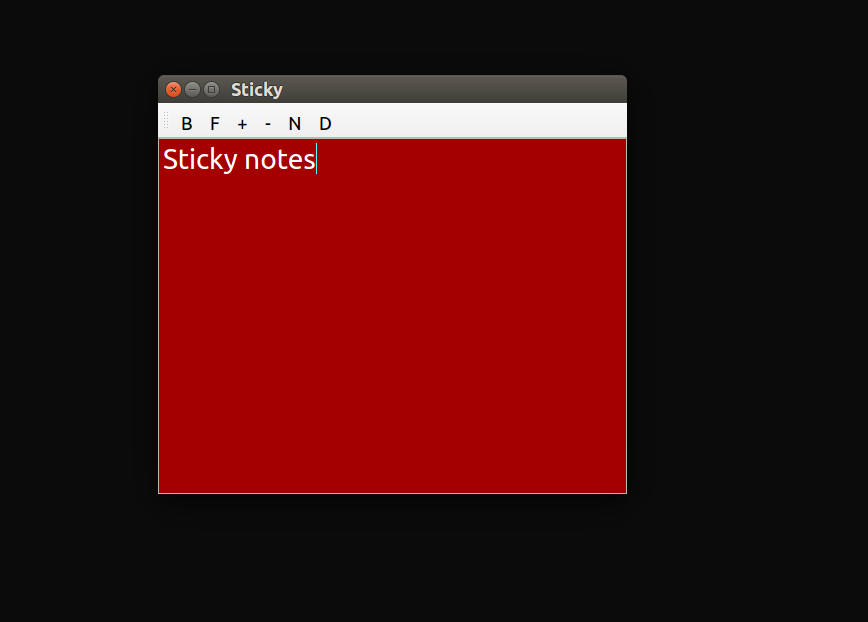

============
Sticky Notes
============
Sticky notes for your desktop

Features
========
* Colorful Text
* Colorful Background
* Font Increase/Decrease

Installtion
===========
pip install stickynotes

Uninstall
=========
pip uninstall stickynotes

Usage
=====
from terminal: 
::
	initsticky
To run in background: 
::
	initsticky & OR nohup initsticky &

screenshots
===========
