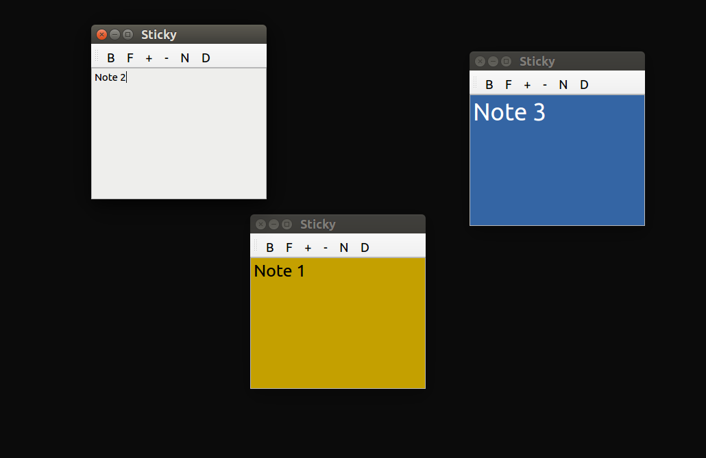

============
Sticky Notes
============
Sticky notes for your desktop

Features
^^^^^^^^^^^^^^^^^^^^^
- Back up of notes with data
- Colored Text
- Colored Background
- Font Size Increase/Decrease

Installation
^^^^^^^^^^^^^^^^^^^^^
- Install

``pip install stickynotes``

- Uninstall 

``pip uninstall stickynotes``

Usage
^^^^^^^^^^^^^^^^^^^^^
- From Terminal

``initsticky``

- To Run in the background

``initsticky &``

- To continue running with closed terminal

``nohup initsticky &``

Screenshots
^^^^^^^^^^^^^^^^^^^^^
